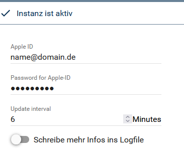
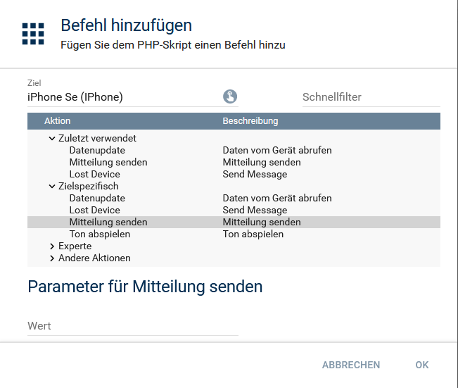
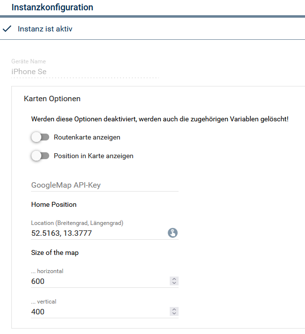

# 
# IPS PHP Biliothek für die Abfrage von Daten eines Apple Gerätes.

Die Kommunikation erfolgt über den "Wo ist?" Dienst von Apple.  
Dazu ist die mit dem Gerät verbundene Apple-ID nötig.  
### 1. Vorraussetzungen

- IP-Symcon ab Version 6.0 (Für die Sende Funktionen stehen entsprechende Aktionen zur Verfügung )
- Apple Gerät mit verbundener Apple-ID
- "Mein IPhone suchen" muss in den Apple-ID-Einstellungen aktiviert sein
### 2. Funktionsumfang
###### Abfragen
- Ladezustand und Ladestatus des Geräts
- Geo Position des Gerätes
###### Berrechnungen aus Position
- Optional: Aktuelle Adresse (Google)
- Planung : (Ermitteln des W3W Standorts https://what3words.com/de/about/)
- Optional: Eintragen der Position in eine Karte (Google)
- Optional: Berrechnen der Route zur Home Adresse (km , Zeit) (Google)
###### Sende Funktionen
- Gerät zum Abspielen eines Suchtones veranlassen 
- An das Gerät eine Mitteilung senden
- Als verloren markieren
- Benachrichtigung wenn gefunden setzen
### 3. Software-Installation

- Über den Module Store das 'IPhone'-Modul installieren.
- Dann den Configurator als Instanz hinzufügen. Das Gateway wird automatisch dazu installiert.
- Im Gateway Apple-ID und Passwort eingeben.
### 4. Folgende Module beinhaltet das IPhone Repository:

- __FindMyiPhoneGateway__  
	Dieses Modul händelt die Verbindung mit Apple.  
	Hier werden die Apple-ID Zugangsdaten und Aktualisierungsintervall eingetragen.  
	Wenn das Intervall auf 0 steht wird nicht zyklisch abgefragt.  
	

- __FindMyiPhoneConfig__  
	Ermittelt die mit der Apple-ID verbundenen Geräte und entsprechende Instanzen können darüber angelegt werden.  
	Wird nur zur Instanzeinrichtung benötigt und kann danach wieder entfernt werden.

- __FindMyiPhoneModul__  
	Für jedes Gerät wird eine Instanz angelegt.  
	Unter dieser Instanz werden die Informationen abgelegt.  
	Für diese Instanz sind entsprechende Aktionen erstellt, um die Sende Funktionen ausführen zu können.  
	  
	Die Karten und Adressinformationen können hier aktiviert werden.  
	Diese werden dann über Google Maps abgefragt. Dazu ist ein persönlicher API Key nötig.  
	Weitere Infos unter folgendem Link:  
	https://developers.google.com/maps/documentation/android-sdk/get-api-key?hl=de  
	
### 5. Weiter Informationen

Aufgebaut ist dieses Modul auf eine PHP class von Neal  
Copyright (c) 2013 Neal <neal@ineal.me>  
https://github.com/Neal/FindMyiPhone  
Thanks for sharing

